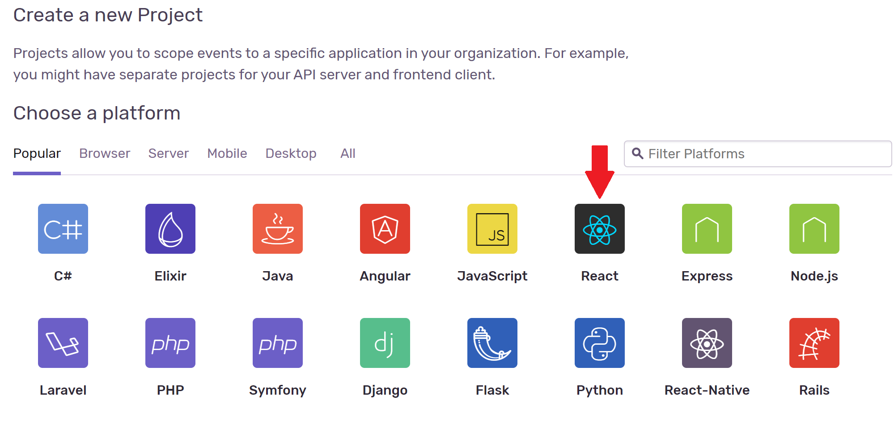

In the terminal provided, you have gotten access to a folder named *sample-app*, which is a basic React application. In this step we will tell you how to start using Sentry on the application, by installing the SDK. You can write `cd sample-app` in the terminal, in order to navigate to the folder containing the different application files. If you write `ls` you can list the different folders and look them through to get a better overview of the app.

# Add Sentry package as a dependency

The *first* thing you need to do is to sign up for an account at https://sentry.io/signup/. Once you have signed up, you can create a new Sentry project. The e-mail you use will by default be used for all the Sentry-notifications. Choose React.js as the platform you will use for the project. 

**INSERT PIC OF HOW IT LOOKS**

You will then need to add the Sentry package as a dependency, which is done by executing the commands stated below. Sentry captures data using an SDK within your application's runtime. These are platform specific and allow Sentry to have a deep understanding of how your application works. 

1. Navigate to the application-folder: `cd sample-app`{{execute}} 

2. Install the Sentry package: `npm install @sentry/browser`{{execute}}

When the installation is complete, you can continue to the next step of the tutorial!
